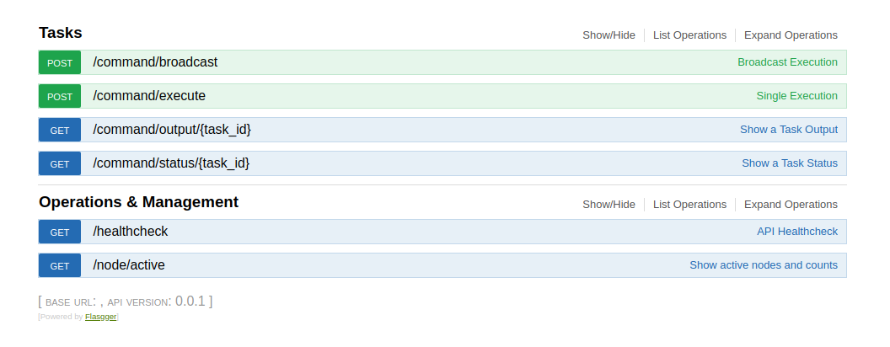

# Shuriken [](https://travis-ci.org/boranx/shuriken)

Shuriken is a simple distributed task executor that can horizontally scalable. It uses RabbitMQ as task queue. The workers will take the task and then execute. You can track results of the task via ```status``` and ```output``` endpoints.

## Requirements

* Vagrant - 1.x.x or 2.x.x

## Run

```shell

vagrant up
vagrant ssh
cd /vagrant # After that, you are ready to go.
make queue # Run a Rabbitmq if you don't have. You can edit endpoints in config file if you have.
make service # Run this in one terminal
make worker # Run this in another terminal. You can execute multiple times on one node or on different nodes.

```

## Run With Docker

```shell

# Master
docker run -d -p 5000:5000 boranx/shuriken-master -e BROKER_HOST=172.17.0.1 # Pass broker URL

# Workers
docker run -d boranx/shuriken-worker -e BROKER_HOST=172.17.0.1 # Pass broker URL
docker run -d boranx/shuriken-worker -e BROKER_HOST=172.17.0.1 # Pass broker URL
.
.
.
# N times on different nodes

```

## Example Requests

API Default port : 5000

POST /command/execute
Payload :

```json

{
    "command":"echo 'foo'"
}

```

Or if you want to broadcast to all workers,

```json

{
    "command":"sudo apt-get update"
}

```

And the response should be like :

```json

{
    "task_id": "45e972c3-5227-4982-bed9-f475d925825e"
}

```

And you can request the status of a task.

GET /command/status/45e972c3-5227-4982-bed9-f475d925825e

And the response should be like :

```json

{
    "Status": "SUCCESS",
    "description": "Task run successfully"
}

```

GET /command/output/45e972c3-5227-4982-bed9-f475d925825e

And the response should be like : (This is also a json now)

```json

{
"output": "foo\n",
"hostname": "celery@vagrant",
"returncode": 0,
"description": "Task run successfully"
}

```

## Swagger

You can track endpoints via swagger

```http://localhost:5000/apidocs```



## Development

```shell

vagrant up # Which will create a VM using Virtualbox, imports current folder as shared folder, install the dependencies from scratch.
vagrant ssh
cd /vagrant # After that, you are ready to go.
make ...

```

## Tests

```shell

make test

```
